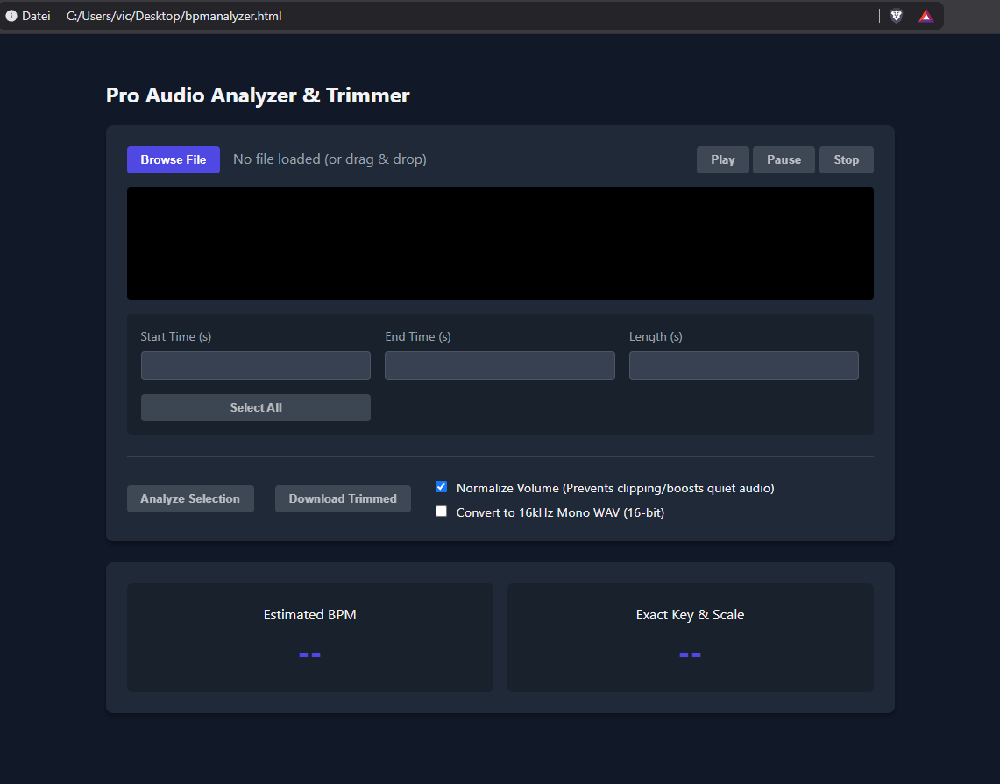

# Lightweight-Pro-Audio-Analyzer-Trimmer (Get BPM/Key of an audio file in your browser)

A powerful, browser-based digital signal processing (DSP) tool for fast audio analysis (BPM + Key/Scale). Including audio trimming and normalization feature. Designed for audio professionals, producers, and developers looking for a lightweight, client-side tool to quickly trim and analyze an audio file.

## 🚀 Features
* **Interactive Waveform:** Visualize audio files with smooth, interactive drag-and-drop region selection powered by [Wavesurfer.js](https://wavesurfer.xyz/).
* **Precise Trimming:** Set exact start, end, and duration times down to the millisecond.
* **Advanced DSP Analysis:**
  * **BPM Detection:** Utilizes low-pass filtered energy histograms to accurately estimate the track's tempo.
  * **Key & Scale Detection:** Implements Chromagrams and Krumhansl-Schmuckler profiles for exact musical key and scale detection.
* **Audio Processing & Export:**
  * Normalize audio to prevent clipping and balance quiet tracks.
  * Optionally convert directly to 16kHz Mono WAV (16-bit) format (great for machine learning and speech-to-text datasets).
  * Download the trimmed and processed `.wav` file seamlessly.
* **Audio Playback:** Play, pause, and stop controls with region-aware playback that resumes where you left off.

## 🛠️ Tech Stack
* **Frontend:** HTML5, CSS3, Vanilla JavaScript (ES6 Modules)
* **Audio Processing:** Native Web Audio API (`AudioContext`, `OfflineAudioContext`, `AnalyserNode`, `BiquadFilter`)
* **Libraries:** Wavesurfer.js v7 + RegionsPlugin (Loaded via CDN)

## 🏃‍♂️ How to Run
It is completely plug-and-play! Because this tool fetches its dependencies via secure CDNs and relies entirely on client-side browser APIs, **no local server or installation is required.**

1. Download or clone this repository.
2. Simply double-click `bpmanalyzer.html` to open it directly in any modern web browser (as shown in `image_51c15b.png`).
3. You're ready to go!

## 🎧 Usage Guide
1. **Load Audio:** Drag and drop an audio file anywhere into the window, or click "Browse File".
2. **Select a Region:** Click and drag on the waveform to highlight a specific portion of the track. You can fine-tune this using the time input boxes below the waveform.
3. **Analyze:** Click "Analyze Selection" to extract the BPM and Musical Key of the active region.
4. **Process & Download:** Check your desired export options (like Normalization) and click "Download Trimmed" to save the `.wav` file to your machine.

## 🔒 Privacy & Security
**100% Client-Side Processing.** No audio files are ever uploaded to an external server. All decoding, DSP analysis, filtering, and exporting happens securely and privately directly within your browser.

## 📝 License
This project is open-source and available under the [MIT License](LICENSE).
